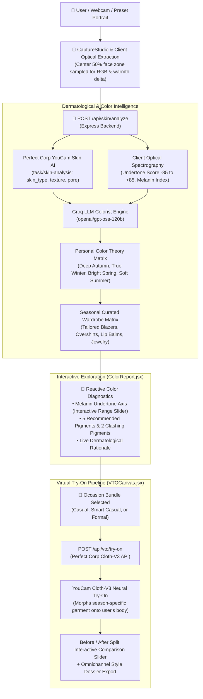

# AuraTone — Documentation Index
> **Comprehensive Product, Architecture, and Hackathon Documentation Suite**  
> *Perfect Corp YouCam API Skin AI & eCommerce Virtual Try-On (VTO) Hackathon*

---

## 📚 Master Documentation Directory

| Document | Primary Focus | Target Audience |
| :--- | :--- | :--- |
| [**DEMO_VIDEO_SCRIPT.md**](./DEMO_VIDEO_SCRIPT.md) | Scene-by-scene 2-minute 45-second timed demo recording script with voiceover and UI cues. | Video Production, Judges, Presenters |
| [**brain.md**](./brain.md) | AI context anchor, system architecture breakdown, color theory matrix, and built-in hero personas. | AI Copilots, Core Engineers |
| [**PRD.md**](./PRD.md) | Product Requirements Document: market opportunity, TAM, e-commerce ROI models, and feature specifications. | Product Managers, Stakeholders |
| [**TRD.md**](./TRD.md) | Technical Requirements Document: API contracts, data models, error-handling protocols, and microservices. | Backend & Frontend Engineers |
| [**APP_FLOW.md**](./APP_FLOW.md) | Interaction architecture, phase-by-phase user journey, state transitions, and UI wireframe flows. | UX Designers, Frontend Engineers |
| [**UI_UX_DESIGN_BRIEF.md**](./UI_UX_DESIGN_BRIEF.md) | Luxury dark glassmorphism aesthetic tokens, color palettes (`#090A0F`, `#D4AF37`), typography, and physics. | UI/UX Designers, Brand Teams |
| [**IMPLEMENTATION_PLAN.md**](./IMPLEMENTATION_PLAN.md) | Phased step-by-step engineering roadmap, milestones, and completed verification deliverables. | Engineering Leads, QA |

---

## 🏛️ System Architecture Summary

---

## 🔬 Core Technical Highlights

1. **Dual YouCam API Synergy:** Integrates Perfect Corp's **Skin AI Analysis** and **Cloth-V3 Generative Apparel VTO** into a seamless color-harmonized pipeline.
2. **Interactive Melanin Undertone Axis:** A responsive range slider enabling users to simulate and fine-tune undertones with instantaneous real-time recalculation of clinical findings, palette resonances, and tailored garments.
3. **Seasonal Wardrobe Routing:** Dynamically routes season-specific tailored garments (Camel Tan for Autumn, Royal Navy for Winter, Cream Ivory for Spring, Slate Gray for Summer) to prevent repetitive try-on looks.
4. **Resilient Quota & Edge-Case Handling:** Graceful status handling for API trial credits while preserving the user's authentic portrait.
5. **Luxury Dark Glassmorphism:** Crafted with tailored design tokens, ambient radiant glows, and fluid micro-animations.

---

*For codebase setup and execution instructions, please refer to the root [README.md](../README.md).*
